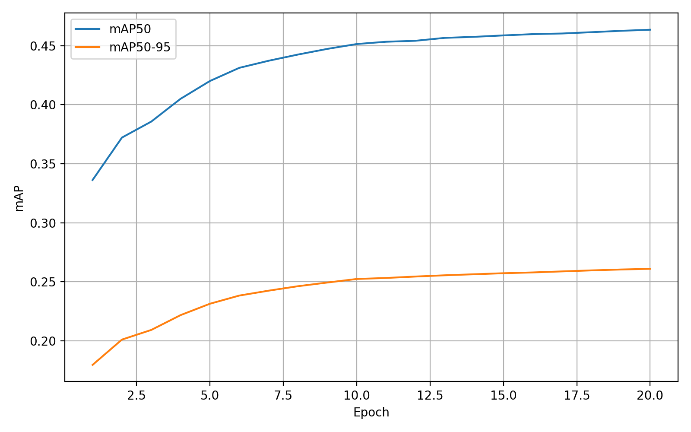
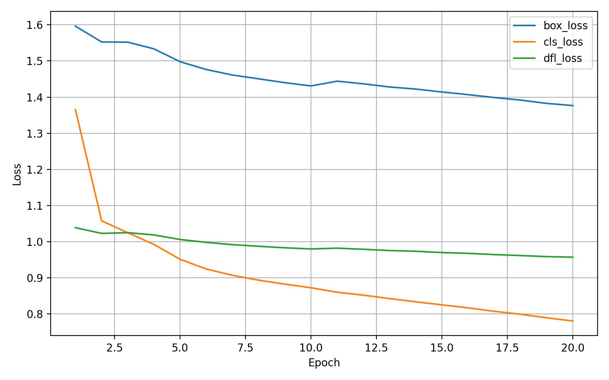
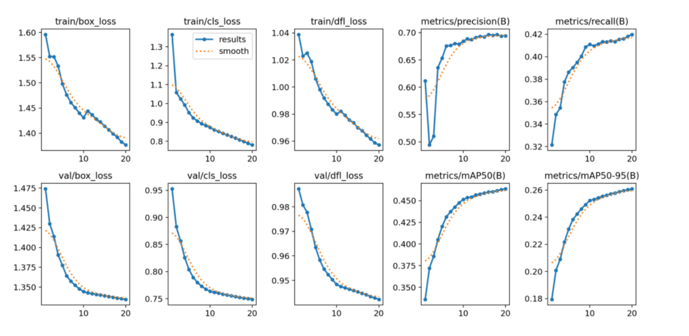

🚦 Traffic Object Detection with YOLOv8
This project implements a traffic object detection system using YOLOv8, trained on a subset of the BDD100K dataset.

The model is capable of detecting multiple road-related objects such as vehicles, pedestrians, riders, traffic lights, and traffic signs.
Training, evaluation, and inference were performed end-to-end using PyTorch and Ultralytics YOLOv8, with GPU acceleration on Google Colab.

📖 Project Overview
Road traffic analysis is a key component of intelligent transportation systems and autonomous driving.

The objectives of this project are to:

Train a YOLOv8 object detection model
Convert BDD100K annotations into YOLO format
Evaluate performance across multiple traffic-related classes
Visualize training metrics and model behavior
Demonstrate inference on real-world traffic images and videos
Provide a clean, reproducible, and well-documented ML pipeline
🧠 Model & Dataset
🔹 Model
Architecture: YOLOv8n (Ultralytics)
Framework: PyTorch
Input resolution: 640 × 640
Epochs: 20
Optimizer: SGD (auto-selected by YOLOv8)
Hardware: NVIDIA Tesla T4 (Google Colab)
🔹 Dataset
Dataset: BDD100K
Task: Object Detection
Annotations: Bounding boxes
Number of classes: 10
Classes:

person
rider
car
truck
bus
train
motorcycle
bicycle
traffic light
traffic sign
⚠️ The raw BDD100K dataset is not included in this repository due to size constraints.

📂 Project Structure
traffic-object-detection-yolov8/
│
├── src/
│   ├── train.py                     # Training script
│   ├── predict.py                   # Inference on images / videos
│   └── convert_bdd100k_to_yolo.py   # Dataset conversion script
│
├── assets/
│   ├── map_curves.png               # mAP evolution curves
│   ├── loss_curves.png              # Training & validation loss curves
│   ├── matrice de confusion.png     # Confusion matrix
│   └── result.png                   # Example inference result
│
├── requirements.txt
├── .gitignore
├── README.md

📊 Training Results

🔹 Mean Average Precision (mAP)

mAP@50: ≈ 0.46

mAP@50–95: ≈ 0.26

These results provide a solid baseline given:

the lightweight YOLOv8n architecture

limited training epochs (20)

class imbalance in the dataset

🔹 Loss Curves
Training and validation losses decrease consistently across epochs, indicating stable convergence and no significant overfitting.

🔹 Confusion Matrix
The confusion matrix shows strong performance for frequent classes such as cars, traffic signs, and traffic lights.

Rare classes (e.g. train, rider) remain more challenging due to fewer samples in the dataset.

🎥 Inference Results
The trained model was tested on real-world traffic scenes.

Example detection output:

The model demonstrates:

Multi-class detection

Robust bounding box localization

Good performance in dense urban traffic scenes

🎬 Large inference videos are intentionally excluded from GitHub due to file size limits.

⚙️ How to Run
1️⃣ Install dependencies
pip install -r requirements.txt
Or manually:

pip install ultralytics opencv-python matplotlib pandas
2️⃣ Train the model
python src/train.py
3️⃣ Run inference on an image or video
python src/predict.py --source path/to/video.mp4 --weights best.pt
🚀 Key Takeaways
Successfully trained a YOLOv8 model for multi-class traffic object detection

Built a complete ML pipeline:
data conversion → training → evaluation → inference

Achieved solid results with limited compute resources

Project structured for reproducibility and professional presentation

🔮 Future Improvements
Train for more epochs

Use a larger model (YOLOv8m / YOLOv8l)

Improve class balance (train, rider, motorcycle)

Apply advanced data augmentation

Export model to ONNX / TensorRT

Benchmark real-time inference performance (FPS)

👤 Author
Francklin
Machine Learning & Computer Vision Project

YOLOv8 · Object Detection · Traffic Analysis
